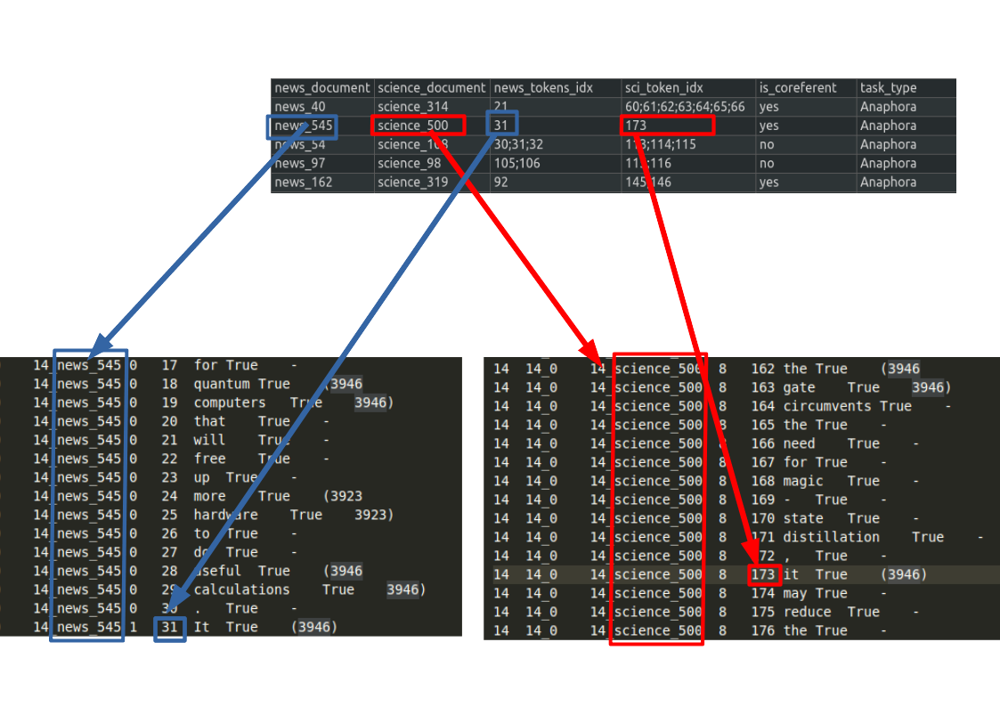

# CDCR ground truthing app

This application can be used to generate ground truth data for the purpose of cross docment coreference resolution.


## Dataset Access

The $CD^2CR$ dataset is provided in CONLL markup format. 

You can download the partitioned dataset here:

 * [train set](CDCR_Corpus/train.conll)
 * [test set](CDCR_Corpus/test.conll)
 * [dev set](CDCR_Corpus/dev.conll)

Document IDs in the corpus follow the convention "{topic_id}_{document_type}_{document_id}" where topic_id uniquely identifies a pair of related news article and scientific paper documents, document_type indicates which of the pair the document is (either news or science) and document_id uniquely identifies the document in our annotation system's RDBMS tables.

A JSON mapping of news article IDs "{something}_news_{id}" to the original URL of the news article can be found here:

 * [news urls](CDCR_Corpus/news_urls.json)

A JSON Mapping of scientific paper IDs "{something}_science_{id}" to the DOI of the scientific paper can be found here:

 * [scientific paper DOIs](CDCR_Corpus/sci_papers.json)

## Checklist tasks

In table 4 of our paper we describe a series of 'challenging' co-reference tasks that we use as test cases/unit tests in the style of [Ribeiro et al](https://www.aclweb.org/anthology/2020.acl-main.442/). 

The specific list of these challenging tasks can be found [here](CDCR_Corpus/checklist_conll_testset.csv). This file contains a list of manually annotated 'is co-referent?' yes/no checks that were hand picked by the authors as particularly difficult as described in [our paper](https://arxiv.org/abs/2101.12637).

Each row gives the document IDs containing the two mentions (corresponding to the document ID in the third column of the test.conll file without the topic prefix), the token indices of the mention separated by semi colons (corresponding to the 5th column in the CoNLL file), is_coreferent indicates whether or not the pair co-refer or not (there are challenging cases of both yes and no that we wanted to explore) and finally the type of task or reason that we picked it.

The below diagram provides visual explanation for how the information fits together



**********************************


# CDCR Annotation Tool

## Installing


### Python

You need Python 3.6 and [poetry](https://python-poetry.org/). Simply run:

`poetry install` 

to install required python modules

### Supporting services

This tool uses a Postgres database (since we use sqlalchemy you could use any suitable db in the backend including sqlite)

We also use redis to temporarily hold state in between page loads.

The package comes with a `docker-compose.yml` which you can use to set up redis, Postgres and Adminer (a web ui for Postgres administration). If you have docker and docker compose installed, simply run: `docker compose up -d` to enable these services.


## Configuring

You will need a .env file with settings for connecting to the database. Use `env.example` as a guide and rename to `.env` so that the app picks up your settings on execution. You can also use environment variables instead if you wish.

### Set up database 

Before you run the application you need to generate the database tables. You can do this by running:

`poetry run alembic upgrade head`

## Running

To run the tool run `poetry run streamlit run --server.runOnSave true cdcrapp/stapp.py` from the commandline.

## Exporting data

Exporting the data is a 2 phase process. Firstly you must generate JSON dump. Secondly you can create CONLL-compatible files.


### Export JSON
First to export json you can run

`poetry run python -m cdcrapp export-json dump.json --seed=42 --split=0.7`

The script will generate test and train files and entity maps so the above command will generate 4 files:

```
dump_train.json
dump_train_entities.json
dump_test.json
dump_test_entities.json
```

Split allows us to specify the ratio of the train and test sets so in this case train will be 70% of data and train 30%.

Seed is the random seed used for shuffling the data. this may be useful if you wish to re-create the same shuffle many times. Seed defaults to `42` which might be confusing if you are expecting different random behaviour but you don't set the seed.

### Export CONLL

The next step is to export CONLL data. This is done with the following command:

`poetry run python -m cdcrapp export-conll dump_test.json ./test.conll`

The command should be run for both `dump_test.json` and `dump_train.json` separately and it will automatically find the associated entities files.